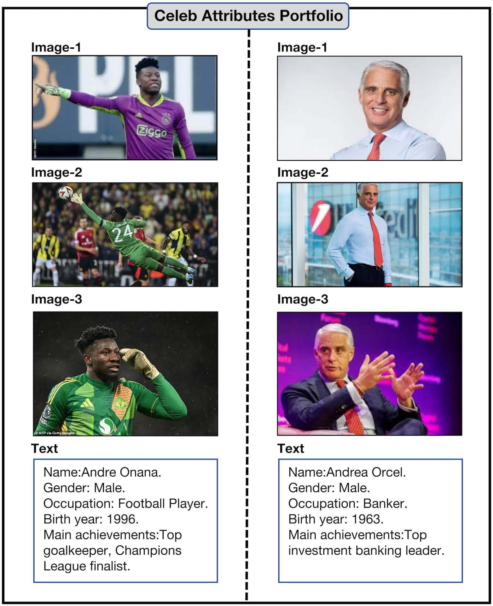

<div align="center">

<h1>[ACM MM2025]Celeb Attributes Portfolio</h1>
  
<div>
  Jinjie Shen<sup>1</sup></a>
  Yaxiong Wang<sup>1</sup></a>
  Lechao Chen<sup>1</sup></a>
  Pu Nan<sup>2</sup></a>
  Zhun Zhong<sup>1</sup></a>
</div>

<div>
    <sup>1</sup>Hefei University of Technology
    <br>
    <sup>2</sup> University
</div>
</div>

## Introduction

We present <b>CAP</b>, a large-scale database including over 80k celebrities. Each celebrity in the CAP has three associated images along with their gender, birth year, occupation, and main achievements.

Two examples from CAP:

<div align="center">

</div>

We provide the Python script `import_cap.py` that automatically integrates CAP information into your custom dataset by identifying all public celebrities mentioned in the textual content of each entry and incorporating their corresponding information.
## Quickly start

### 🔧Format Requirements

- The file must be a **JSON array** (i.e., a list of objects).
- Every object must contain a `"text"` field.

### 📄 Example JSON File

```json
[
  {
    "id": "001",
    "text": "Julian Assange leaving court after his application for bail Journalists tweeted updates while the hearing was in progress",
    "other_info": "...",
     "..."
  },
  {
    "id": "002",
    "text": "Little Mix and mentor Tommy Gunn were nt expecting to win The X Factor",
    "tags": ["example", "test"],
    "..."
  }
]
```

### Download CAP

Click here to download CAP, which includes the folder `people_imgs` and the json file `cap_texts.json`.

### 🚀Run script


```
python your_script.py \
  --path_A "/path/to/your/dataset.json" \
  --path_B "/path/to/cap_texts.json" \
  --folder_path "/path/to/people_imgs" \
  --output_path "/path/to/output.json"
```
